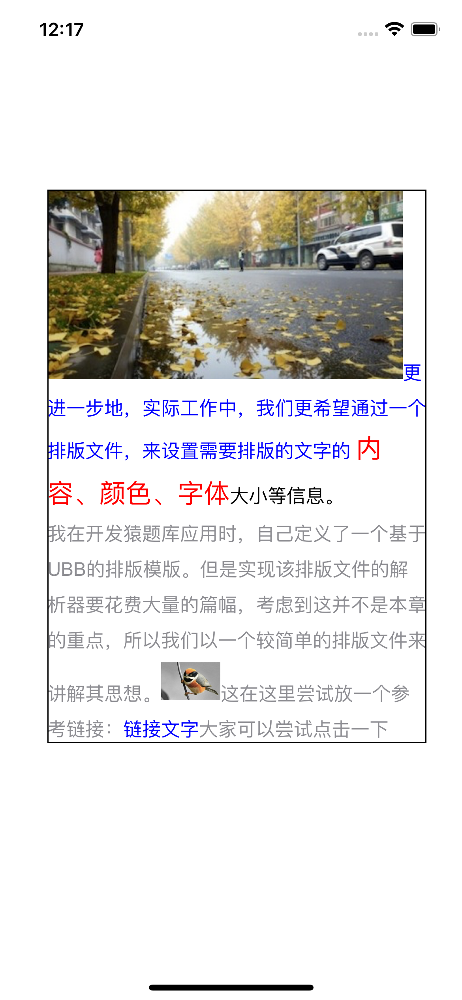
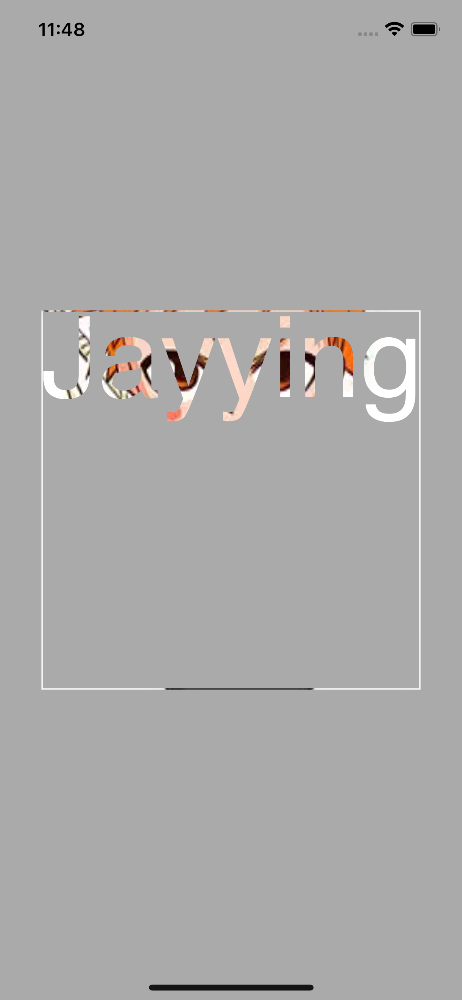
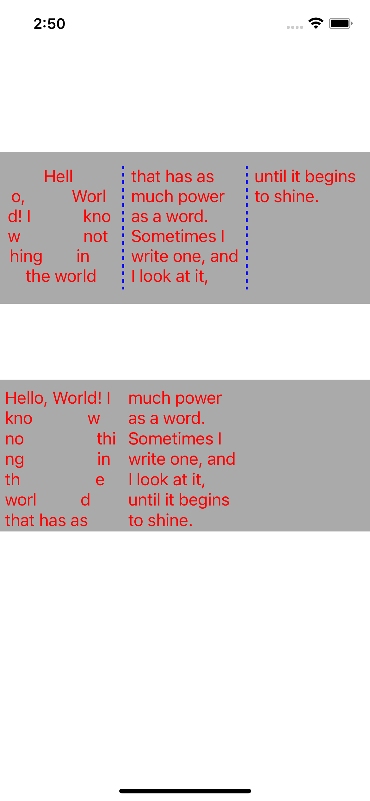
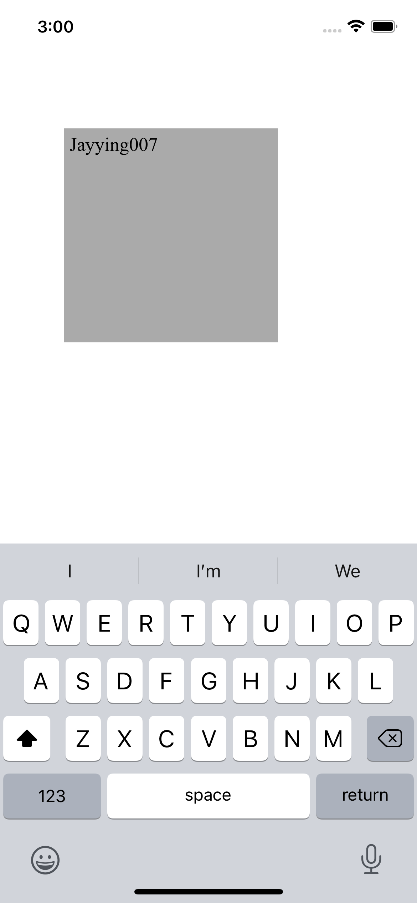
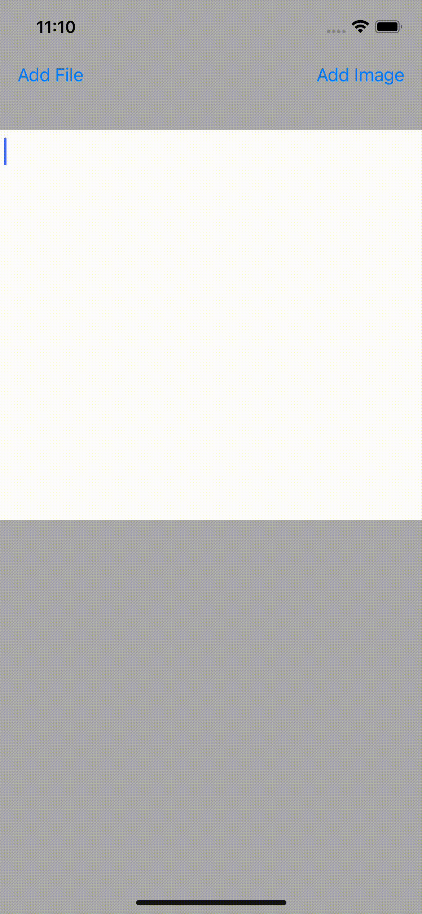
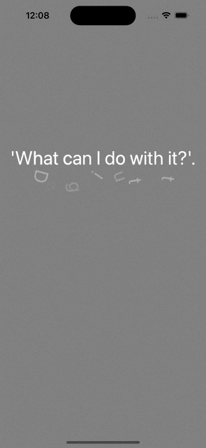

### TQCoreText

这个例子取自《iOS开发进阶》，里面的图片和链接均可响应点击事件。不过，还需要自己实现选择复制的能力。
唐巧前辈那里有实现，不过这里为了简单，没有加上去。

---
### TextMask

可以让一张图片只显示文字覆盖的地方；此外，这里还实现了自动调整字体大小，以撑满一行。

---
### ColumnarLayout

分别用CoreText和TextKit的方式，实现了文本不规则排版、分列排版

---
### CustomTextInput

自定义TextView，不是继承自UITextView，而是继承自UIView，然后重写UITextInput相关逻辑。

代码大部分来自于苹果的例子：https://developer.apple.com/library/archive/samplecode/SimpleTextInput/Introduction/Intro.html

不过苹果的那个例子有好几个bug，这里做了修复。

---
### MMTextView

实现一个富文本编辑器，可以插入任意类型的UIView，也支持复制粘贴，代码精简。

---
### TextKitLayout

利用TextKit实现的几个小功能

---
### MMTextAnimationLabel

参考：https://github.com/OnePieceLv/TextKitAndAnimationEffect